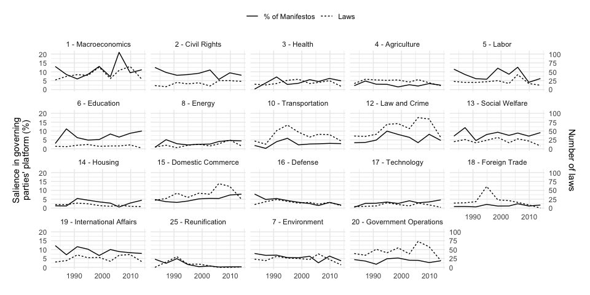
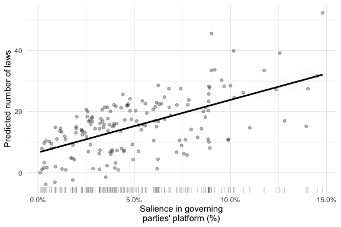

<!-- README.md is generated from README.Rmd. Please edit that file -->

This repo contains the replication material for the journal article
‘(When) do Electoral Mandates Set the Agenda? Government Capacity and
Mandate Responsiveness in Germany’ published in the European Journal of
Political Research

## Structure of the repo

The repo consists in three different folders:

-   [data](https://github.com/benjaminguinaudeau/replication_mandate_responsiveness/tree/master/data)
    : data required to replicate our findings
-   [models](https://github.com/benjaminguinaudeau/replication_mandate_responsiveness/tree/master/models)
    : do-file and r-script to replicate the models

Because Panel-Poisson Regression with FE is not properly implemented in
R, we estimated some of the models in Stata 13.1. For this reason, the
replication code includes both one do-file and one R-Script.

## Packages

``` r
library(tidyverse, quietly = T)
#> ── Attaching packages ─────────────────────────────────────── tidyverse 1.3.0 ──
#> ✓ ggplot2 3.3.5     ✓ purrr   0.3.4
#> ✓ tibble  3.1.6     ✓ dplyr   1.0.7
#> ✓ tidyr   1.1.3     ✓ stringr 1.4.0
#> ✓ readr   2.1.2     ✓ forcats 0.5.0
#> ── Conflicts ────────────────────────────────────────── tidyverse_conflicts() ──
#> x dplyr::filter() masks stats::filter()
#> x dplyr::lag()    masks stats::lag()
```

## Data

### data/monthly.csv

The main arguments of our paper is tested at the month level. It hence
includes data for the most important variables at the month X topic
level. It is provided as a csv-file, named ‘monthly.csv’.

It contains following columns:

-   n\_laws: Number of laws adopted in a given month in a given topic
-   month: Concerned Month
-   topic: Concerned CAP Topic
-   salience\_seat: Average salience of the topic in the manifestos of
    the coalition partners (weighted by number of seats)
-   clp: Cumulative Law Production
-   time: Cumulative number of months since beginning of the dataset
-   ideo\_gov: Ideological orientation of a coalition (‘Scharz-Gelb’,
    ‘Rot-Grün’, ‘Big coalition’)
-   gov\_pop\_l1: Average government popularity in the last six months
-   bundesratmaj: 1 if the governing coalition enjoyed majority in the
    Bundesrat
-   elec\_cycle\_12: Elecotral cycle (First 12 months/Routine/Last 12
    months)
-   rile\_diff: Absolute difference between the left-right position of
    coalition partners
-   salience\_diff: Absolute difference between the salience of a given
    topic in the manifestos of the coalition partners
-   europe: Percentage of laws within a topic within a given period
    influenced by the EU
-   account\_balance\_perc\_l1: Budget account balance in the last six
    months
-   salience\_chanc: Salience of the topic in the manifesto of the
    chancellor party
-   salience\_partner: Salience of the topic in the manifesto of the
    junior partner
-   salience\_gov: Average salience of the topic in the manifestos of
    the coalition partners (no weights)
-   salience\_perc: Average salience of the topic in the manifestos of
    the coalition partners (weighted by each party’s vote percentage)
-   gov\_pop\_delta: First difference of the government popularity
    between the last month and the actual month

``` r
dplyr::glimpse(readr::read_csv("data/monthly.csv", show_col_types = FALSE))
#> Rows: 7,106
#> Columns: 20
#> $ n_laws                  <dbl> 0, 0, 0, 0, 0, 0, 2, 0, 0, 0, 0, 0, 1, 0, 0, 0…
#> $ month                   <date> 1983-09-01, 1983-09-01, 1983-09-01, 1983-09-0…
#> $ topic                   <dbl> 12, 2420, 1, 15, 19, 4, 13, 14, 16, 8, 10, 2, …
#> $ salience_seat           <dbl> 3.1779792, 4.1083406, 17.6766180, 3.7491338, 1…
#> $ clp                     <dbl> 0, 0, 0, 0, 0, 0, 0, 0, 0, 0, 0, 0, 0, 0, 0, 0…
#> $ time                    <dbl> 1, 1, 1, 1, 1, 1, 1, 1, 1, 1, 1, 1, 1, 1, 1, 1…
#> $ ideo_gov                <dbl> 1, 1, 1, 1, 1, 1, 1, 1, 1, 1, 1, 1, 1, 1, 1, 1…
#> $ gov_pop_l1              <dbl> 0.6764418, 0.6764418, 0.6764418, 0.6764418, 0.…
#> $ bundesratmaj            <dbl> 1, 1, 1, 1, 1, 1, 1, 1, 1, 1, 1, 1, 1, 1, 1, 1…
#> $ elec_cycle_12           <dbl> 1, 1, 1, 1, 1, 1, 1, 1, 1, 1, 1, 1, 1, 1, 1, 1…
#> $ rile_diff               <dbl> 25.927, 25.927, 25.927, 25.927, 25.927, 25.927…
#> $ salience_diff           <dbl> 0.0067050311, 0.0068333013, 0.1241538542, 0.02…
#> $ europe                  <dbl> 0.11428571, 0.03125000, 0.10000000, 0.36363636…
#> $ account_balance_perc_l1 <dbl> 0.712464, 0.712464, 0.712464, 0.712464, 0.7124…
#> $ salience_chanc          <dbl> 3.0959752, 4.0247678, 19.1950464, 3.4055728, 1…
#> $ salience_partner        <dbl> 3.7664783, 4.7080979, 6.7796610, 6.2146893, 11…
#> $ salience_gov            <dbl> 3.4312268, 4.3664329, 12.9873537, 4.8101310, 1…
#> $ salience_perc           <dbl> 3.1795911, 4.1099833, 17.6467707, 3.7558871, 1…
#> $ gov_pop_delta           <dbl> -0.1430775, -0.1430775, -0.1430775, -0.1430775…
#> $ start_date              <date> 1983-03-30, 1983-03-30, 1983-03-30, 1983-03-3…
```

### data/term\_level.csv

We also provide a file aggregated at the level of the term to replicate
some of the results presented in the appendix. It contains following
variables:

-   n\_laws: Number of laws adopted in a given term in a given topic
-   topic: Concerned CAP Topic
-   salience\_seat: Average salience of the topic in the manifestos of
    the coalition partners (weighted by number of seats)
-   time: Number of terms since the beginning of the dataset
-   europe: Proportion of laws within a given topic and a given term
    influenced by the European Union
-   account\_balance\_perc: Average Budget account balance
-   rile\_diff: Absolute difference between the left-right position of
    coalition partners
-   salience\_diff: Absolute difference between the salience of a given
    topic in the manifestos of the coalition partners

``` r
dplyr::glimpse(readr::read_csv("data/term_level.csv", show_col_types = FALSE))
#> Rows: 171
#> Columns: 8
#> $ n_laws               <dbl> 65, 40, 84, 22, 5, 61, 16, 9, 9, 36, 25, 58, 0, 2…
#> $ topic                <dbl> 1, 10, 12, 13, 14, 15, 16, 17, 18, 19, 2, 2420, 2…
#> $ salience_seat        <dbl> 10.1658546, 3.3332858, 9.0178376, 6.4178301, 3.43…
#> $ time                 <dbl> 8, 8, 8, 8, 8, 8, 8, 8, 8, 8, 8, 8, 8, 8, 8, 8, 8…
#> $ europe               <dbl> 0.3247694, 0.5689024, 0.3392430, 0.2530785, 0.278…
#> $ account_balance_perc <dbl> 6.389846, 6.389846, 6.389846, 6.389846, 6.389846,…
#> $ rile_diff            <dbl> 4.452, 4.452, 4.452, 4.452, 4.452, 4.452, 4.452, …
#> $ salience_diff        <dbl> 0.032144306, 0.012690077, 0.038148504, 0.03364001…
```

### data/salience\_percentage.csv

In this file, data are also included at the term level but the dependent
variable is computed as the proportion of all laws adopted within a
given legislature. This allows to normlasize for the total number of
adopted laws, which varies across the period. The columns are
essentially the same than in the term level data, with one exception:

-   law\_prop: Proportion of laws adopted in a given term in a given
    topic

``` r
dplyr::glimpse(readr::read_csv("data/salience_percentage.csv", show_col_types = FALSE))
#> Rows: 171
#> Columns: 8
#> $ topic                <dbl> 1, 10, 12, 13, 14, 15, 16, 17, 18, 19, 2, 2420, 2…
#> $ law_prop             <dbl> 11.8397086, 7.2859745, 15.3005464, 4.0072860, 0.9…
#> $ salience_seat        <dbl> 10.1658546, 3.3332858, 9.0178376, 6.4178301, 3.43…
#> $ time                 <dbl> 8, 8, 8, 8, 8, 8, 8, 8, 8, 8, 8, 8, 8, 8, 8, 8, 8…
#> $ europe               <dbl> 0.3247694, 0.5689024, 0.3392430, 0.2530785, 0.278…
#> $ account_balance_perc <dbl> 6.389846, 6.389846, 6.389846, 6.389846, 6.389846,…
#> $ rile_diff            <dbl> 4.452, 4.452, 4.452, 4.452, 4.452, 4.452, 4.452, …
#> $ salience_diff        <dbl> 0.032144306, 0.012690077, 0.038148504, 0.03364001…
```

### data/no\_eu.csv

This dataset is the same as monthly.csv, but was generated after
removing all laws impacted by the EU.

``` r
dplyr::glimpse(readr::read_csv("data/no_eu.csv", show_col_types = FALSE))
#> Rows: 7,467
#> Columns: 13
#> $ month                   <date> 1981-03-01, 1981-03-01, 1981-03-01, 1981-03-0…
#> $ n_laws                  <dbl> 0, 0, 1, 0, 0, 0, 0, 0, 0, 0, 0, 0, 0, 0, 0, 0…
#> $ salience_seat           <dbl> 5.1142279, 2.4021123, 8.6859406, 2.8039303, 14…
#> $ clp                     <dbl> 0, 0, 0, 0, 0, 0, 0, 0, 0, 0, 0, 0, 0, 0, 0, 0…
#> $ time                    <dbl> 1, 1, 1, 1, 1, 1, 1, 1, 1, 1, 1, 1, 1, 1, 1, 1…
#> $ elec_cycle_12           <chr> "first_months", "first_months", "first_months"…
#> $ gov_pop_l1              <dbl> 1.859615, 1.859615, 1.859615, 1.859615, 1.8596…
#> $ europe                  <dbl> 0.16279070, 0.03225806, 0.06944444, 0.22727273…
#> $ account_balance_perc_l1 <dbl> -1.653697, -1.653697, -1.653697, -1.653697, -1…
#> $ bundesratmaj            <dbl> 0, 0, 0, 0, 0, 0, 0, 0, 0, 0, 0, 0, 0, 0, 0, 0…
#> $ rile_diff               <dbl> 13.219, 13.219, 13.219, 13.219, 13.219, 13.219…
#> $ salience_diff           <dbl> 0.0144862298, 0.0322528735, 0.0416657153, 0.02…
#> $ topic                   <dbl> 12, 2420, 1, 15, 19, 4, 13, 14, 16, 8, 10, 2, …
```

## Models

| Model \# | Script | Data            |
|----------|--------|-----------------|
| 1-10     | Stata  | monthly.csv     |
| 11-16    | R      | monthly.csv     |
| 17       | Stata  | term\_level.csv |
| 18-19    | R      | term\_level.csv |
| 20-21    | R      | monthly.csv     |
| 22-27    | Stata  | monthly.csv     |
| 28       | Stata  | no\_eu.csv      |
| 29-34    | R      | no\_eu.csv      |

## Figures

### Figure 1: Issue attention in German governing parties’ manifestos and adopted legislation (1983-2016)

``` r
topic_dict <- tribble(
  ~topic, ~p_topic, ~name,
  1, 1, "Macroeconomics",
  2, 2, "Civil Rights", 
  3, 3, "Health", 
  4, 4, "Agriculture", 
  5, 5, "Labor", 
  6, 6, "Education", 
  721, 7, "Environment",
  8, 8, "Energy",
  10,10, "Transportation", 
  12,12, "Law and Crime", 
  13,13, "Social Welfare", 
  14,14, "Housing", 
  15,15, "Domestic Commerce", 
  16,16, "Defense", 
  17,17, "Technology", 
  18,18, "Foreign Trade", 
  19,19, "International Affairs", 
  2420,20, "Government Operations", 
  25,25, "Reunification"
) %>%
  mutate(label = fct_reorder(paste(p_topic, name, sep = " - "), topic)) %>%
  select(topic, label)

readr::read_csv("data/monthly.csv", show_col_types = FALSE) %>%
  group_by(start_date, topic) %>%
  summarise(n_laws = sum(n_laws), 
            salience_gov = unique(salience_gov)) %>%
  dplyr::select(start_date, topic, salience_gov, n_laws) %>%
  mutate(n_laws = n_laws/5,
         topic = fct_reorder(factor(topic), as.numeric(topic))) %>%
  select(start_date, n_laws, salience_gov, topic) %>%
  mutate(topic = as.numeric(as.character(topic))) %>%
  pivot_longer(cols = c(n_laws, salience_gov)) %>%
  left_join(topic_dict) %>%
  mutate(name = ifelse(name == "n_laws", "Laws", "% of Manifestos")) %>%
  ggplot(aes(x = start_date)) + 
  geom_line(aes(y = value, linetype = name)) +
  facet_wrap(~label) + 
  scale_y_continuous(sec.axis = sec_axis(~ . *5, "Number of laws")) +
  theme_minimal() +
  labs(x = "", y = "Salience in governing\nparties' platform (%)", linetype = "") +
  theme(legend.position = "top", 
        axis.title.y.left = element_text(margin = margin(r = 10, l = 10)),
        axis.title.y.right = element_text(margin = margin(r = 10, l = 10)))
#> `summarise()` has grouped output by 'start_date'. You can override using the `.groups` argument.
#> Joining, by = "topic"
```

<!-- -->

### Figure 2: Predicted number of laws adopted during a mandate period, conditional on platform salience

This figure is based on the predicted number of laws as obtained in
Stata from Model 4 with the command ‘predict’.

``` r
readr::read_csv("data/preds.csv", show_col_types = FALSE) %>%
  mutate(salience_seat = as.numeric(salience_seat/100)) %>%
  filter(salience_seat < .15) %>%
  group_by(start_date, topic, salience_seat) %>%
  summarise(n_total_law_pred = sum(yhat)) %>%
  ungroup %>%
  ggplot(aes(x = salience_seat, y = n_total_law_pred)) + 
  geom_smooth(method = "lm", se = T, alpha = .02, color = "black") +
  theme_minimal() +
  scale_x_continuous(labels = scales::percent_format()) +
  geom_jitter(alpha = .3) +
  geom_rug(aes(y = NULL), alpha=.2) +
  labs(y = "Predicted number of laws", x = "Salience in governing\nparties' platform (%)")
#> `summarise()` has grouped output by 'start_date', 'topic'. You can override using the `.groups` argument.
#> `geom_smooth()` using formula 'y ~ x'
```

<!-- -->

### Figure 4-5

These figures simply depict, without further transformation, the
marginal effect as obtained in Stata with the fonction ‘margin’.
